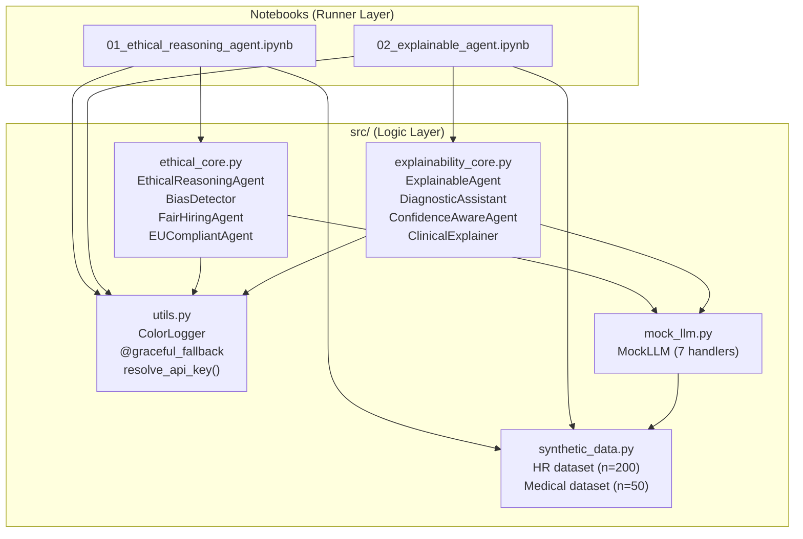

# Chapter 12: Ethical and Explainable Agents

**Book:** *30 Agents Every AI Engineer Must Build*
**Author:** Imran Ahmad
**Publisher:** Packt Publishing
**Chapter:** 12 — Ethical and Explainable Agents

---

## Overview

This repository contains the complete, runnable code for Chapter 12. It covers two
major agent architectures and two end-to-end case studies:

| Architecture | Case Study | Notebook |
|---|---|---|
| **Ethical Reasoning Agent** | HR Assistant with Fairness Constraints | `01_ethical_reasoning_agent.ipynb` |
| **Explainable Agent** | Medical Diagnosis Assistant with Explanation | `02_explainable_agent.ipynb` |

Key topics implemented:

- Deontic logic for value alignment (obligation, permission, prohibition)
- The Ethical Consistency Theorem and Impossibility of Fairness Theorem
- EU AI Act seven-requirement compliance checking
- Bias detection with three fairness metrics (demographic parity, equal opportunity, disparate impact)
- Real-time bias monitoring with sliding window alerts
- Fair hiring pipeline with three mitigation strategies (reweighting, threshold adjustment, representation learning)
- Reasoning transparency with immutable audit trails
- SHAP and LIME feature attribution for model explanations
- Counterfactual analysis for minimal-change explanations
- Confidence-aware agents with calibration and uncertainty communication
- Audience-adapted clinical explanations (clinician vs. patient)

---

## Simulation Mode

This repository runs fully out of the box — **no API key required**.

Every LLM call is backed by a context-aware `MockLLM` that returns chapter-faithful,
deterministic responses. All synthetic datasets are seeded (`seed=42`) for reproducibility.

When no `OPENAI_API_KEY` is detected, a blue `[INFO]` banner confirms Simulation Mode:

```
[INFO] No API key detected. Running in Simulation Mode with chapter-derived
mock data. All outputs are synthetic. Supply an OpenAI API key via .env for
live mode.
```

To switch to **Live Mode**, copy `.env.template` to `.env` and add your key:

```bash
cp .env.template .env
# Edit .env and set: OPENAI_API_KEY=sk-...
```

---

## Quick Start

```bash
# 1. Clone the repository
git clone https://github.com/<your-org>/chapter12-ethical-explainable-agents.git
cd chapter12-ethical-explainable-agents

# 2. Create a virtual environment (recommended)
python -m venv .venv
source .venv/bin/activate   # Windows: .venv\Scripts\activate

# 3. Install dependencies
pip install -r requirements.txt

# 4. (Optional) Configure API key
cp .env.template .env
# Edit .env if you have an OpenAI key; leave blank for Simulation Mode.

# 5. Launch Jupyter and run the notebooks
jupyter lab notebooks/
```

For Google Colab, run `!pip install -r requirements.txt` in the first cell.

---

## Architecture



---

## Repository Structure

```
chapter12-ethical-explainable-agents/
│
├── README.md                  # This file
├── AGENTS.md                  # Agentic metadata and persona definition
├── LICENSE                    # MIT License
├── requirements.txt           # Pinned dependencies
├── .env.template              # API key placeholder
├── .gitignore
│
├── notebooks/
│   ├── 01_ethical_reasoning_agent.ipynb   # Ethical Agent + HR case study
│   └── 02_explainable_agent.ipynb        # Explainable Agent + Medical case study
│
├── src/
│   ├── __init__.py             # Package exports (34 public symbols)
│   ├── utils.py                # ColorLogger, @graceful_fallback, mode detection
│   ├── mock_llm.py             # Context-aware MockLLM with 7 handlers
│   ├── synthetic_data.py       # Seeded HR and Medical dataset generators
│   ├── ethical_core.py         # Deontic logic, bias detection, fair hiring
│   └── explainability_core.py  # SHAP/LIME, counterfactuals, diagnostic pipeline
│
├── data/
│   └── .gitkeep
│
└── docs/
    └── TROUBLESHOOTING.md      # Dependency conflicts and runtime issues
```

---

## Notebook Guide

### Notebook 01: Ethical Reasoning Agent (p.3–23)

Covers value alignment, deontic logic, the EU AI Act, bias detection, and a complete
fair hiring pipeline. Visual outputs include color-coded compliance logs,
before/after fairness comparison charts, and a bias metric dashboard.

**Key demonstrations:**
- Three deontic axioms and the Ethical Consistency Theorem (p.5–7)
- EthicalReasoningAgent with modular validators and audit trail (p.8–9)
- EU AI Act seven-requirement compliance check (p.10–11)
- Impossibility of Fairness Theorem — Table 12.1 (p.12–13)
- BiasDetector on synthetic HR data — disparate impact = 0.73 (p.14–19)
- FairHiringAgent: anonymize → score → detect bias → mitigate (p.20–23)

### Notebook 02: Explainable Agent (p.23–39)

Covers reasoning transparency, feature attribution (SHAP/LIME), counterfactual
analysis, confidence communication, and a medical diagnosis case study. Visual
outputs include SHAP summary plots, counterfactual tables, and clinician vs. patient
explanation side-by-side comparisons.

**Key demonstrations:**
- ExplainableAgent with four-step decision logging (p.24–25)
- SHAP and LIME on a trained diagnostic model (p.26)
- Counterfactual analysis — minimal feature changes to flip a decision (p.27)
- ConfidenceAwareAgent with calibration and qualifier mapping (p.28–29)
- DiagnosticAssistant: biometrics → symptoms → differentials → explanation (p.30–35)
- Production failure mode demonstrations (p.35)

---

## Defensive Design

All code follows a resilience-first philosophy:

- **`@graceful_fallback` decorator** wraps every LLM/tool/computation call. On failure,
  it logs a red `[HANDLED ERROR]` with the chapter section reference and returns a
  safe default with identical schema to the success path.

- **Color-coded logging** via `ColorLogger`:
  - `[DEBUG]` Yellow — internal diagnostics
  - `[INFO]` Blue — mode banners, progress updates
  - `[SUCCESS]` Green — step completions, passing checks
  - `[HANDLED ERROR]` Red — caught failures, fallback activations

- **Zero hardcoded secrets** — API keys resolve through `.env` → `getpass` → Simulation Mode.

---

## Dependencies

All versions are pinned with floor and ceiling in `requirements.txt`. Key packages:

| Package | Purpose |
|---|---|
| `langchain`, `langchain-openai` | LLM framework (Live Mode) |
| `openai` | OpenAI SDK 1.x |
| `shap` | SHAP feature attribution |
| `lime` | LIME local explanations |
| `scikit-learn` | Diagnostic model training |
| `numpy`, `pandas` | Data handling |
| `matplotlib`, `seaborn` | Visualization |
| `python-dotenv` | Environment variable management |

See `docs/TROUBLESHOOTING.md` for dependency conflict resolutions.

---

## License

MIT License. See [LICENSE](LICENSE) for details.

---

## Author

**Imran Ahmad** — Packt Publishing

*30 Agents Every AI Engineer Must Build*, Chapter 12: Ethical and Explainable Agents
